
# RockCrawler
This is a remix version of an RC Rock Crawler that I found on Thingiverse.
The original model got deleted since then. So I included the original here.
The remix was first publish in Thingiverse at [Remix Rc Rock Crawler, new gearbox](https://www.thingiverse.com/thing:5236263).
I modified the gearbox to make it slower, hence with more torque.

General instruction:

1. Make sure the printer is well calibrated. Specifically the extruder. The extrusion factor, also know as the extrusion multiplier, will have a big impact on the way the pieces fits together. I personnaly use that guide before using a new filament: [Extrusion Multiplier](https://ellis3dp.com/Print-Tuning-Guide/articles/extrusion_multiplier.html)
2. Print every pieces in PLA.
3. Print the shock in PETG to get more flexibility.
4. If you decide to print the tires print them in TPU, the softest one you can find. The grip is not very good with printed tires. For better grip you can buy the tires. In that case print the wheel part wheel_26_5mm.stl.
4. If the screws tend to break the plastic part you can enlarge the hole with a drill bit.
4. Use plenty of light grease in the gear box
5. Use a bit of light grease in the wheel hub.
6. If the center drive shaft keep falling off you can print this longer one: Center_Drive_Shaft_P2_15.55mm.stl.
7. I provided a longer shock shock_46mm_stl. The short version tend to keep the car a bit low.

Video:

1. [In action](https://youtu.be/3EBpf9YP5C4)
2. [Showing the shock](https://youtu.be/YSYngEb9dG8)
3. [Gearbox assembly](https://youtu.be/KAkp_eB5qdQ)

I found a link to the original video from the original designer:

1. [Make an RC Rock Crawler - Part 1](https://www.youtube.com/watch?v=WgZuojB2sF8&t=138s)
2. [Make an RC Rock Crawler - Part 2](https://www.youtube.com/watch?v=jjvKoB2oO8Q&t=319s)

Documentation generated by the OpenSCAD library [NopSCADlib](https://github.com/nophead/NopSCADlib/tree/master).

License: [Creative Commons - Attribution - Share Alike](https://creativecommons.org/licenses/by-sa/3.0/).

---
## Table of Contents
1. [Parts list](#Parts_list)
1. [Wheel Left Assembly](#wheel_left_assembly)
1. [Wheel Right Assembly](#wheel_right_assembly)
1. [Drive Shaft Assembly](#drive_shaft_assembly)
1. [Servo Control Link Assembly](#Servo_control_link_assembly)
1. [Hub R Assembly](#Hub_R_assembly)
1. [Hub L Assembly](#Hub_L_assembly)
1. [Axle Part1 1 R Assembly](#Axle_part1_1_R_assembly)
1. [Axle Part1 1 L Assembly](#Axle_part1_1_L_assembly)
1. [G34 Assembly](#G34_assembly)
1. [Axle Part1 Assembly](#Axle_part1_assembly)
1. [Axle Part2 Assembly](#Axle_part2_assembly)
1. [Axle Part3 Assembly](#Axle_part3_assembly)
1. [Axle Part4 Assembly](#Axle_part4_assembly)
1. [Axle Part5 Assembly](#Axle_part5_assembly)
1. [Axle Part6 Assembly](#Axle_part6_assembly)
1. [Axle Part7 Assembly](#Axle_part7_assembly)
1. [Axle Final Assembly](#Axle_final_assembly)
1. [GearBox Part1 Assembly](#gearBox_part1_assembly)
1. [GearBox Part2 Assembly](#gearBox_part2_assembly)
1. [GearBox Part3 Assembly](#gearBox_part3_assembly)
1. [GearBox Part4 Assembly](#gearBox_part4_assembly)
1. [GearBox Part5 Assembly](#gearBox_part5_assembly)
1. [GearBox Part6 Assembly](#gearBox_part6_assembly)
1. [GearBox Part7 Assembly](#gearBox_part7_assembly)
1. [GearBox Final Assembly](#gearBox_final_assembly)
1. [Suspension Part1 Assembly](#suspension_part1_assembly)
1. [Suspension Part2 Assembly](#suspension_part2_assembly)
1. [Main Assembly](#main_assembly)

[Top](#TOP)

---

## Parts list
| 2 x Axle&nbsp;Final | GearBox&nbsp;Final | Main | TOTALS |  |
|---:|---:|---:|---:|:---|
|  |  |  | | **Vitamins** |
| &nbsp;&nbsp;8&nbsp; | &nbsp;&nbsp;.&nbsp; | &nbsp;&nbsp;.&nbsp; |  &nbsp;&nbsp;8&nbsp; | &nbsp;&nbsp; Ball bearing MR128-2RS 8mm x 12mm x 3.5mm |
| &nbsp;&nbsp;6&nbsp; | &nbsp;&nbsp;2&nbsp; | &nbsp;&nbsp;.&nbsp; |  &nbsp;&nbsp;8&nbsp; | &nbsp;&nbsp; Ball bearing MR63ZZ 5mm x 8mm x 2.5mm |
| &nbsp;&nbsp;16&nbsp; | &nbsp;&nbsp;4&nbsp; | &nbsp;&nbsp;.&nbsp; |  &nbsp;&nbsp;20&nbsp; | &nbsp;&nbsp; Screw M2 pan self tap x  5mm |
| &nbsp;&nbsp;18&nbsp; | &nbsp;&nbsp;8&nbsp; | &nbsp;&nbsp;4&nbsp; |  &nbsp;&nbsp;30&nbsp; | &nbsp;&nbsp; Screw M2 pan self tap x  6mm |
| &nbsp;&nbsp;4&nbsp; | &nbsp;&nbsp;.&nbsp; | &nbsp;&nbsp;4&nbsp; |  &nbsp;&nbsp;8&nbsp; | &nbsp;&nbsp; Screw M2 pan self tap x  8mm |
| &nbsp;&nbsp;14&nbsp; | &nbsp;&nbsp;12&nbsp; | &nbsp;&nbsp;.&nbsp; |  &nbsp;&nbsp;26&nbsp; | &nbsp;&nbsp; Screw M2 pan self tap x 10mm |
| &nbsp;&nbsp;10&nbsp; | &nbsp;&nbsp;4&nbsp; | &nbsp;&nbsp;.&nbsp; |  &nbsp;&nbsp;14&nbsp; | &nbsp;&nbsp; Screw M2 pan self tap x 12mm |
| &nbsp;&nbsp;.&nbsp; | &nbsp;&nbsp;1&nbsp; | &nbsp;&nbsp;.&nbsp; |  &nbsp;&nbsp;1&nbsp; | &nbsp;&nbsp; Smooth rod 2mm x 10mm |
| &nbsp;&nbsp;2&nbsp; | &nbsp;&nbsp;.&nbsp; | &nbsp;&nbsp;.&nbsp; |  &nbsp;&nbsp;2&nbsp; | &nbsp;&nbsp; Threaded rod M2 x 10mm |
| &nbsp;&nbsp;2&nbsp; | &nbsp;&nbsp;.&nbsp; | &nbsp;&nbsp;.&nbsp; |  &nbsp;&nbsp;2&nbsp; | &nbsp;&nbsp;RC servo SG90 |
| &nbsp;&nbsp;.&nbsp; | &nbsp;&nbsp;1&nbsp; | &nbsp;&nbsp;.&nbsp; |  &nbsp;&nbsp;1&nbsp; | &nbsp;&nbsp;motor 130, 6 volts |
| &nbsp;&nbsp;80&nbsp; | &nbsp;&nbsp;32&nbsp; | &nbsp;&nbsp;8&nbsp; | &nbsp;&nbsp;120&nbsp; | &nbsp;&nbsp;Total vitamins count |
|  |  |  | | **3D printed parts** |
| &nbsp;&nbsp;2&nbsp; | &nbsp;&nbsp;.&nbsp; | &nbsp;&nbsp;.&nbsp; |  &nbsp;&nbsp;2&nbsp; | &nbsp;&nbsp;5_5_ball_Closed.stl |
| &nbsp;&nbsp;16&nbsp; | &nbsp;&nbsp;12&nbsp; | &nbsp;&nbsp;.&nbsp; |  &nbsp;&nbsp;28&nbsp; | &nbsp;&nbsp;5_5_ball_Open.stl |
| &nbsp;&nbsp;2&nbsp; | &nbsp;&nbsp;.&nbsp; | &nbsp;&nbsp;.&nbsp; |  &nbsp;&nbsp;2&nbsp; | &nbsp;&nbsp;Axle_Case_p1.stl |
| &nbsp;&nbsp;2&nbsp; | &nbsp;&nbsp;.&nbsp; | &nbsp;&nbsp;.&nbsp; |  &nbsp;&nbsp;2&nbsp; | &nbsp;&nbsp;Axle_Case_p2.stl |
| &nbsp;&nbsp;8&nbsp; | &nbsp;&nbsp;.&nbsp; | &nbsp;&nbsp;.&nbsp; |  &nbsp;&nbsp;8&nbsp; | &nbsp;&nbsp;Axle_Case_p3.stl |
| &nbsp;&nbsp;4&nbsp; | &nbsp;&nbsp;.&nbsp; | &nbsp;&nbsp;.&nbsp; |  &nbsp;&nbsp;4&nbsp; | &nbsp;&nbsp;Axle_Case_p4.stl |
| &nbsp;&nbsp;.&nbsp; | &nbsp;&nbsp;.&nbsp; | &nbsp;&nbsp;4&nbsp; |  &nbsp;&nbsp;4&nbsp; | &nbsp;&nbsp;Ball_Link_29mm.stl |
| &nbsp;&nbsp;.&nbsp; | &nbsp;&nbsp;.&nbsp; | &nbsp;&nbsp;4&nbsp; |  &nbsp;&nbsp;4&nbsp; | &nbsp;&nbsp;Ball_Link_41mm.stl |
| &nbsp;&nbsp;2&nbsp; | &nbsp;&nbsp;.&nbsp; | &nbsp;&nbsp;.&nbsp; |  &nbsp;&nbsp;2&nbsp; | &nbsp;&nbsp;Ball_Link_62mm.stl |
| &nbsp;&nbsp;2&nbsp; | &nbsp;&nbsp;2&nbsp; | &nbsp;&nbsp;.&nbsp; |  &nbsp;&nbsp;4&nbsp; | &nbsp;&nbsp;Center_Drive_Cup.stl |
| &nbsp;&nbsp;.&nbsp; | &nbsp;&nbsp;.&nbsp; | &nbsp;&nbsp;4&nbsp; |  &nbsp;&nbsp;4&nbsp; | &nbsp;&nbsp;Center_Drive_Shaft_P1.stl |
| &nbsp;&nbsp;.&nbsp; | &nbsp;&nbsp;.&nbsp; | &nbsp;&nbsp;2&nbsp; |  &nbsp;&nbsp;2&nbsp; | &nbsp;&nbsp;Center_Drive_Shaft_P2.stl |
| &nbsp;&nbsp;.&nbsp; | &nbsp;&nbsp;.&nbsp; | &nbsp;&nbsp;1&nbsp; |  &nbsp;&nbsp;1&nbsp; | &nbsp;&nbsp;Center_Drive_Shaft_P2_15_5mm.stl |
| &nbsp;&nbsp;4&nbsp; | &nbsp;&nbsp;.&nbsp; | &nbsp;&nbsp;.&nbsp; |  &nbsp;&nbsp;4&nbsp; | &nbsp;&nbsp;Drive_Cup.stl |
| &nbsp;&nbsp;4&nbsp; | &nbsp;&nbsp;.&nbsp; | &nbsp;&nbsp;.&nbsp; |  &nbsp;&nbsp;4&nbsp; | &nbsp;&nbsp;Drive_Shaft.stl |
| &nbsp;&nbsp;2&nbsp; | &nbsp;&nbsp;.&nbsp; | &nbsp;&nbsp;.&nbsp; |  &nbsp;&nbsp;2&nbsp; | &nbsp;&nbsp;G34_P14_p1.stl |
| &nbsp;&nbsp;2&nbsp; | &nbsp;&nbsp;.&nbsp; | &nbsp;&nbsp;.&nbsp; |  &nbsp;&nbsp;2&nbsp; | &nbsp;&nbsp;G34_P14_p2.stl |
| &nbsp;&nbsp;4&nbsp; | &nbsp;&nbsp;.&nbsp; | &nbsp;&nbsp;.&nbsp; |  &nbsp;&nbsp;4&nbsp; | &nbsp;&nbsp;Hub.stl |
| &nbsp;&nbsp;4&nbsp; | &nbsp;&nbsp;.&nbsp; | &nbsp;&nbsp;.&nbsp; |  &nbsp;&nbsp;4&nbsp; | &nbsp;&nbsp;Link_Closed_35mm.stl |
| &nbsp;&nbsp;.&nbsp; | &nbsp;&nbsp;1&nbsp; | &nbsp;&nbsp;.&nbsp; |  &nbsp;&nbsp;1&nbsp; | &nbsp;&nbsp;Motor_Holder.stl |
| &nbsp;&nbsp;2&nbsp; | &nbsp;&nbsp;.&nbsp; | &nbsp;&nbsp;.&nbsp; |  &nbsp;&nbsp;2&nbsp; | &nbsp;&nbsp;P14_G34.stl |
| &nbsp;&nbsp;4&nbsp; | &nbsp;&nbsp;.&nbsp; | &nbsp;&nbsp;.&nbsp; |  &nbsp;&nbsp;4&nbsp; | &nbsp;&nbsp;Servo_Holder.stl |
| &nbsp;&nbsp;2&nbsp; | &nbsp;&nbsp;.&nbsp; | &nbsp;&nbsp;.&nbsp; |  &nbsp;&nbsp;2&nbsp; | &nbsp;&nbsp;Servo_Horn.stl |
| &nbsp;&nbsp;.&nbsp; | &nbsp;&nbsp;.&nbsp; | &nbsp;&nbsp;4&nbsp; |  &nbsp;&nbsp;4&nbsp; | &nbsp;&nbsp;Wheel.stl |
| &nbsp;&nbsp;.&nbsp; | &nbsp;&nbsp;.&nbsp; | &nbsp;&nbsp;1&nbsp; |  &nbsp;&nbsp;1&nbsp; | &nbsp;&nbsp;body_v3.stl |
| &nbsp;&nbsp;.&nbsp; | &nbsp;&nbsp;1&nbsp; | &nbsp;&nbsp;.&nbsp; |  &nbsp;&nbsp;1&nbsp; | &nbsp;&nbsp;firstStageGear.stl |
| &nbsp;&nbsp;.&nbsp; | &nbsp;&nbsp;1&nbsp; | &nbsp;&nbsp;.&nbsp; |  &nbsp;&nbsp;1&nbsp; | &nbsp;&nbsp;frameBack_v2_1.stl |
| &nbsp;&nbsp;.&nbsp; | &nbsp;&nbsp;1&nbsp; | &nbsp;&nbsp;.&nbsp; |  &nbsp;&nbsp;1&nbsp; | &nbsp;&nbsp;frameFront_v2_1.stl |
| &nbsp;&nbsp;.&nbsp; | &nbsp;&nbsp;1&nbsp; | &nbsp;&nbsp;.&nbsp; |  &nbsp;&nbsp;1&nbsp; | &nbsp;&nbsp;gearMotor.stl |
| &nbsp;&nbsp;.&nbsp; | &nbsp;&nbsp;1&nbsp; | &nbsp;&nbsp;.&nbsp; |  &nbsp;&nbsp;1&nbsp; | &nbsp;&nbsp;gearboxBack_v2.stl |
| &nbsp;&nbsp;.&nbsp; | &nbsp;&nbsp;1&nbsp; | &nbsp;&nbsp;.&nbsp; |  &nbsp;&nbsp;1&nbsp; | &nbsp;&nbsp;gearboxFront_v2.stl |
| &nbsp;&nbsp;.&nbsp; | &nbsp;&nbsp;1&nbsp; | &nbsp;&nbsp;.&nbsp; |  &nbsp;&nbsp;1&nbsp; | &nbsp;&nbsp;plate_long_v2.stl |
| &nbsp;&nbsp;.&nbsp; | &nbsp;&nbsp;1&nbsp; | &nbsp;&nbsp;.&nbsp; |  &nbsp;&nbsp;1&nbsp; | &nbsp;&nbsp;secondStageGear.stl |
| &nbsp;&nbsp;.&nbsp; | &nbsp;&nbsp;.&nbsp; | &nbsp;&nbsp;4&nbsp; |  &nbsp;&nbsp;4&nbsp; | &nbsp;&nbsp;shock_43mm.stl |
| &nbsp;&nbsp;.&nbsp; | &nbsp;&nbsp;.&nbsp; | &nbsp;&nbsp;1&nbsp; |  &nbsp;&nbsp;1&nbsp; | &nbsp;&nbsp;shock_46mm.stl |
| &nbsp;&nbsp;.&nbsp; | &nbsp;&nbsp;.&nbsp; | &nbsp;&nbsp;4&nbsp; |  &nbsp;&nbsp;4&nbsp; | &nbsp;&nbsp;tire_v3.stl |
| &nbsp;&nbsp;.&nbsp; | &nbsp;&nbsp;.&nbsp; | &nbsp;&nbsp;1&nbsp; |  &nbsp;&nbsp;1&nbsp; | &nbsp;&nbsp;wheel_26_5mm.stl |
| &nbsp;&nbsp;66&nbsp; | &nbsp;&nbsp;23&nbsp; | &nbsp;&nbsp;30&nbsp; | &nbsp;&nbsp;119&nbsp; | &nbsp;&nbsp;Total 3D printed parts count |

[Top](#TOP)

---

## 2 x Wheel Left Assembly
### 3D Printed parts

| 2 x Wheel.stl | 2 x tire_v3.stl |
|---|---|
|  |  

### Assembly instructions
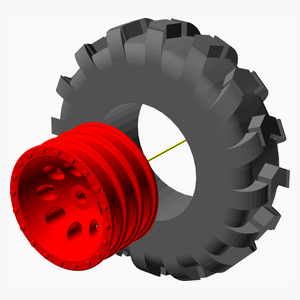

1. Install the tire on the rim

[Top](#TOP)

---

## 2 x Wheel Right Assembly
### 3D Printed parts

| 2 x Wheel.stl | 2 x tire_v3.stl |
|---|---|
|  |  

### Assembly instructions
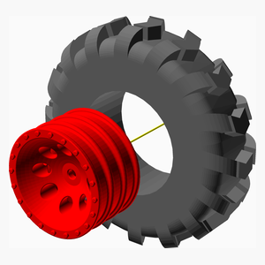

1. Install the tire on the rim the thread oriented the other way compare to the wheel_left_assembly.

[Top](#TOP)

---

## 2 x Drive Shaft Assembly
### 3D Printed parts

| 4 x Center_Drive_Shaft_P1.stl | 2 x Center_Drive_Shaft_P2.stl |
|---|---|
|  | 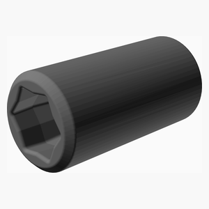 

### Assembly instructions

1. It is a good idea to print the Center_Drive_Shaft_P2 in TPU. It makes the assembly a bit easier
2. Press fix both Center_Drive_Shaft_P1 into Center_Drive_Shaft_P2.

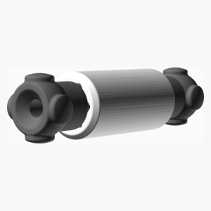

[Top](#TOP)

---

## 2 x Servo Control Link Assembly
### Vitamins
|Qty|Description|
|---:|:----------|
|2| Threaded rod M2 x 10mm|

### 3D Printed parts

| 4 x Link_Closed_35mm.stl |
|---|
|  

### Assembly instructions

1. Screw both Link_Closed_35mm on a 10 mm M2 threaded rod. Leave a gap of about 1 or 2 mm in the middle.

[Top](#TOP)

---

## 2 x Hub R Assembly
### Vitamins
|Qty|Description|
|---:|:----------|
|2| Ball bearing MR128-2RS 8mm x 12mm x 3.5mm|
|2| Ball bearing MR63ZZ 5mm x 8mm x 2.5mm|
|2| Screw M2 pan self tap x 10mm|

### 3D Printed parts

| 2 x 5_5_ball_Open.stl | 2 x Drive_Cup.stl | 2 x Hub.stl |
|---|---|---|
|  |  | 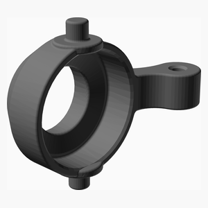 

### Assembly instructions

1. Install a 5_5_ball_Open with a M2 self tapping screw 10 mm.
2. Install a bearing MR128 in the hub.
3. Install a bearing MR63 in the hub.
4. Install a Drive_Cup in the hub.

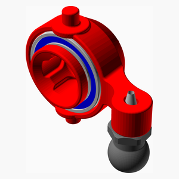

[Top](#TOP)

---

## 2 x Hub L Assembly
### Vitamins
|Qty|Description|
|---:|:----------|
|2| Ball bearing MR128-2RS 8mm x 12mm x 3.5mm|
|2| Ball bearing MR63ZZ 5mm x 8mm x 2.5mm|
|2| Screw M2 pan self tap x 12mm|

### 3D Printed parts

| 2 x 5_5_ball_Closed.stl | 2 x 5_5_ball_Open.stl | 2 x Drive_Cup.stl |
|---|---|---|
|  |  |  

| 2 x Hub.stl |
|---|
|  

### Assembly instructions

1. Crew together a 5_5_ball_Open and a 5_5_ball_Closed with a M2 self tapping screw 12 mm.
2. Install a bearing MR128 in the Hub.
3. Install a bearing MR63 in the Hub.
4. Install a Drive_Cup in the Hub.

[Top](#TOP)

---

## 2 x Axle Part1 1 R Assembly
### Vitamins
|Qty|Description|
|---:|:----------|
|2| Screw M2 pan self tap x  8mm|

### 3D Printed parts

| 2 x 5_5_ball_Open.stl | 2 x Servo_Holder.stl |
|---|---|
|  |  

### Assembly instructions

1. Install a 5_5_ball_Closed on right side of a Servo_Holder using a M2 self tapping screw 8 mm.

[Top](#TOP)

---

## 2 x Axle Part1 1 L Assembly
### Vitamins
|Qty|Description|
|---:|:----------|
|2| Screw M2 pan self tap x  8mm|

### 3D Printed parts

| 2 x 5_5_ball_Open.stl | 2 x Servo_Holder.stl |
|---|---|
|  |  

### Assembly instructions
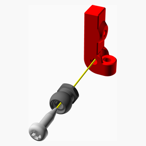

1. Install a 5_5_ball_Closed on left side of a Servo_Holder using a M2 self tapping screw 8 mm.

[Top](#TOP)

---

## 2 x G34 Assembly
### Vitamins
|Qty|Description|
|---:|:----------|
|4| Ball bearing MR128-2RS 8mm x 12mm x 3.5mm|
|2| Screw M2 pan self tap x  6mm|

### 3D Printed parts

| 2 x G34_P14_p1.stl | 2 x G34_P14_p2.stl |
|---|---|
|  |  

### Assembly instructions
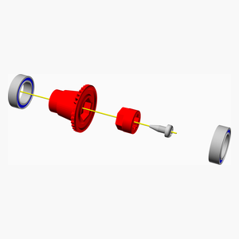

1. Insert G34_P14_p2 in G34_P14_p1 using a M2 self tapping screw 8 mm.
2. Add the ball bearing MR128 at both ends.

[Top](#TOP)

---

## 4 x Axle Part1 Assembly
### Vitamins
|Qty|Description|
|---:|:----------|
|4| Screw M2 pan self tap x 10mm|

### 3D Printed parts

| 4 x 5_5_ball_Open.stl | 4 x Axle_Case_p4.stl |
|---|---|
|  |  

### Assembly instructions

1. Install a 5_5_ball_Closed on Axel_Case_p4 using a M2 self tapping screw 8 mm.

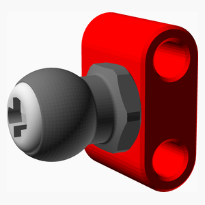

[Top](#TOP)

---

## 2 x Axle Part2 Assembly
### Vitamins
|Qty|Description|
|---:|:----------|
|8| Screw M2 pan self tap x 12mm|

### 3D Printed parts

| 2 x Axle_Case_p1.stl |
|---|
|  

### Sub-assemblies

| 4 x Axle_part1_assembly |
|---|
|  

### Assembly instructions

1. Install both Axle_part1_assembly on the Axle_Case_p1 with 4 M2 self tapping screw 12 mm.

[Top](#TOP)

---

## 2 x Axle Part3 Assembly
### Vitamins
|Qty|Description|
|---:|:----------|
|2| Ball bearing MR63ZZ 5mm x 8mm x 2.5mm|
|8| Screw M2 pan self tap x  6mm|

### 3D Printed parts

| 2 x Axle_Case_p2.stl | 4 x Drive_Shaft.stl | 2 x P14_G34.stl |
|---|---|---|
|  |  | 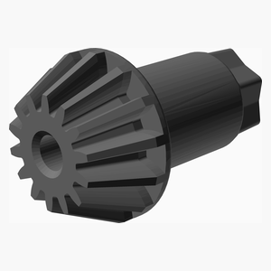 

### Sub-assemblies

| 2 x Axle_part2_assembly | 2 x G34_assembly |
|---|---|
|  |  

### Assembly instructions

1. Insert G34_assembly in the axle.
2. Install ball bearing MR63 on P14_G34.
3. Install P14_G34 in Axle_Case_p2.
4. Fix Axle_Case_p2 on Axle_Case_p1 with 4 M2 self tapping screw 6 mm.
5. Insert both Drive_Shaft in axle. Note: there is no ball bearing on the shaft.

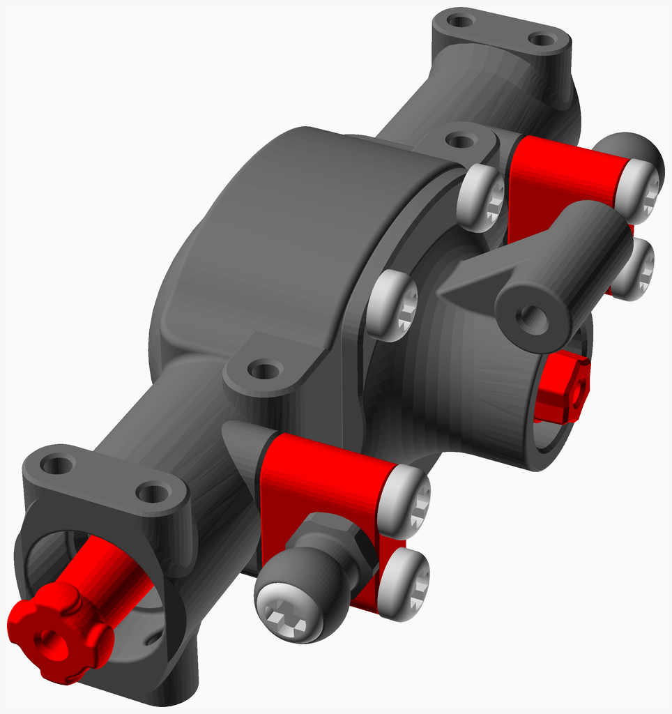

[Top](#TOP)

---

## 2 x Axle Part4 Assembly
### Vitamins
|Qty|Description|
|---:|:----------|
|8| Screw M2 pan self tap x 10mm|

### 3D Printed parts

| 4 x 5_5_ball_Open.stl |
|---|
|  

### Sub-assemblies

| 2 x Axle_part1_1_L_assembly | 2 x Axle_part1_1_R_assembly | 2 x Axle_part3_assembly |
|---|---|---|
|  |  | 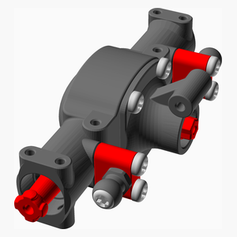 

### Assembly instructions
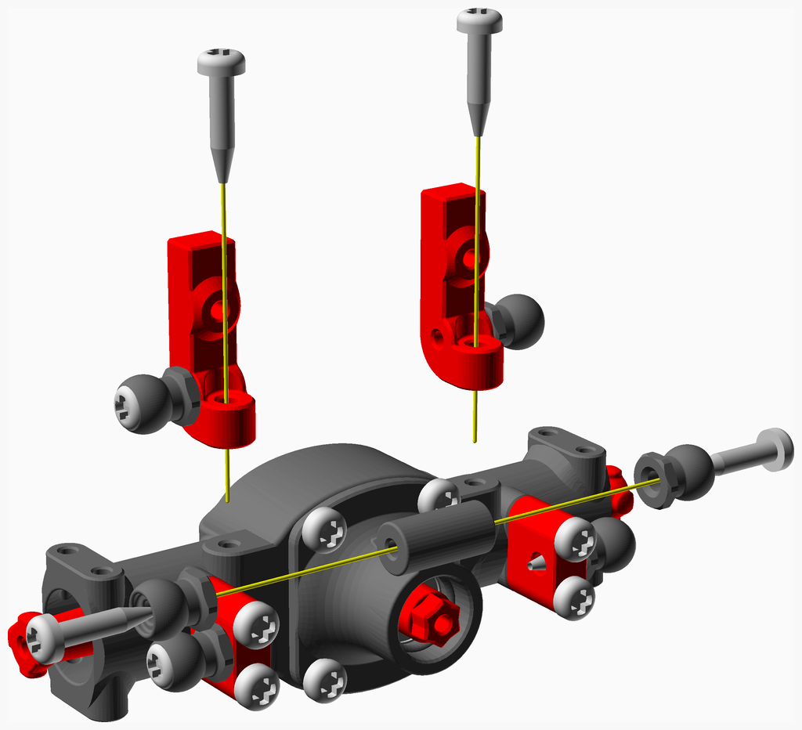

1. Install two 5_5_ball_Closed on Axle_Case_p2 with M2 self tapping screw 10 mm.
2. Install the servo holders (Axle_part1_1_L_assembly & Axle_part1_1_R_assembly) on Axle_Case_p2 with 2 M2 self tapping screw 10 mm.

[Top](#TOP)

---

## 2 x Axle Part5 Assembly
### Vitamins
|Qty|Description|
|---:|:----------|
|16| Screw M2 pan self tap x  5mm|
|2| Screw M2 pan self tap x  6mm|

### 3D Printed parts

| 8 x Axle_Case_p3.stl | 2 x Center_Drive_Cup.stl |
|---|---|
| 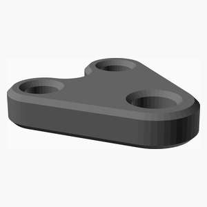 |  

### Sub-assemblies

| 2 x Axle_part4_assembly | 2 x Hub_L_assembly | 2 x Hub_R_assembly |
|---|---|---|
| 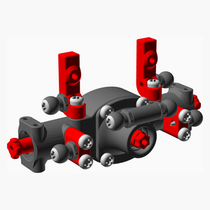 |  |  

### Assembly instructions
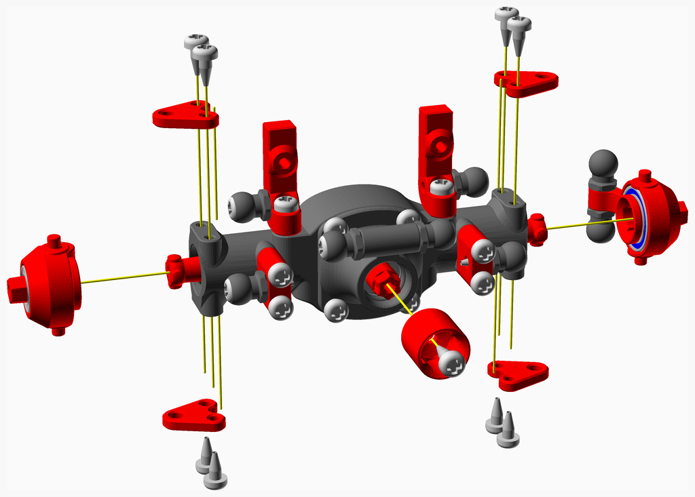

1. Install the Center_Drive_Cup in the Axle with a M2 self tapping screw 8 mm.
2. Install the Hub_L_assembly along with two Axle_Case_p3 with 4 M2 self tapping screw 5 mm
3. Install the Hub_R_assembly along with two Axle_Case_p3 with 4 M2 self tapping screw 5 mm

[Top](#TOP)

---

## 2 x Axle Part6 Assembly
### Vitamins
|Qty|Description|
|---:|:----------|
|4| Screw M2 pan self tap x  6mm|
|2|RC servo SG90|

### Sub-assemblies

| 2 x Axle_part5_assembly |
|---|
| 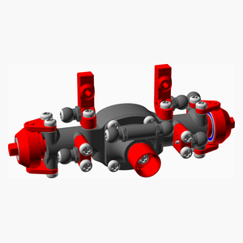 

### Assembly instructions

1. Install the servo SG90 with 2 M2 self tapping screw 6 mm.

[Top](#TOP)

---

## 2 x Axle Part7 Assembly
### Vitamins
|Qty|Description|
|---:|:----------|
|2| Screw M2 pan self tap x  6mm|

### 3D Printed parts

| 2 x Servo_Horn.stl |
|---|
| 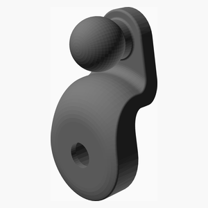 

### Sub-assemblies

| 2 x Axle_part6_assembly |
|---|
|  

### Assembly instructions
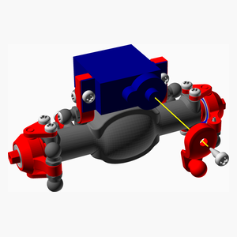

1. Install the servo horn using the screw that came with the servo.

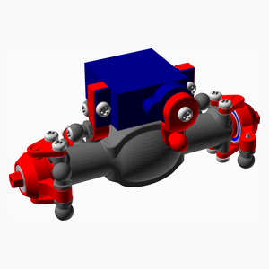

[Top](#TOP)

---

## 2 x Axle Final Assembly
### 3D Printed parts

| 2 x Ball_Link_62mm.stl |
|---|
|  

### Sub-assemblies

| 2 x Axle_part7_assembly | 2 x Servo_control_link_assembly |
|---|---|
|  |  

### Assembly instructions
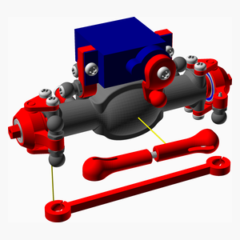

1. Install a Servo_control_link_assembly from the servo horn to left hub.
2. Install a Ball_Link_62mm between the two hubs.

[Top](#TOP)

---

## GearBox Part1 Assembly
### Vitamins
|Qty|Description|
|---:|:----------|
|1| Ball bearing MR63ZZ 5mm x 8mm x 2.5mm|
|4| Screw M2 pan self tap x  5mm|

### 3D Printed parts

| 1 x frameFront_v2_1.stl | 1 x gearboxFront_v2.stl |
|---|---|
| 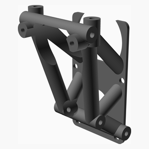 | 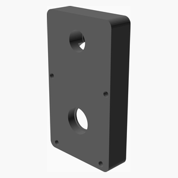 

### Assembly instructions
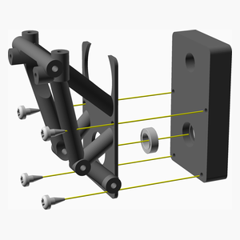

1. step 1

[Top](#TOP)

---

## GearBox Part2 Assembly
### Vitamins
|Qty|Description|
|---:|:----------|
|1| Smooth rod 2mm x 10mm|

### 3D Printed parts

| 1 x firstStageGear.stl | 1 x secondStageGear.stl |
|---|---|
|  |  

### Sub-assemblies

| 1 x gearBox_part1_assembly |
|---|
|  

### Assembly instructions
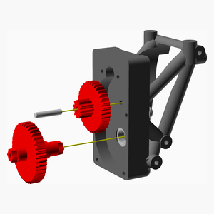

1. Make sure the whole in firstStageGear is 2 mm using a 2 mm drill.
2. Make sure the whole in frameFront_v2_1 is 2mm using a 2 mm drill. Do not go through the case.
3. Put some grease on both side ot firstStageGear.
3. Insert the 2 mm rod in the firstStageGear. Then insert in the frameFront_v2_1. Make sure it turns freely.
4. Put some grease on both side ot secondStageGear.
5. Insert secondStageGear on top of firstStageGear.

[Top](#TOP)

---

## GearBox Part3 Assembly
### Vitamins
|Qty|Description|
|---:|:----------|
|2| Screw M2 pan self tap x  6mm|
|1|motor 130, 6 volts|

### 3D Printed parts

| 1 x Motor_Holder.stl | 1 x gearMotor.stl |
|---|---|
|  | 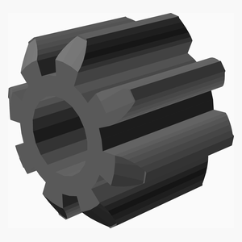 

### Sub-assemblies

| 1 x gearBox_part2_assembly |
|---|
|  

### Assembly instructions

1. If your motor didn't come with a 8 thooht then insert the gearMotor onto the motor
2. Insert the motor. Make sure the gear are turning fine.
3. Install the Motor_Holder with 2 M2 self tapping screw 6 or 8 mm.

[Top](#TOP)

---

## GearBox Part4 Assembly
### Vitamins
|Qty|Description|
|---:|:----------|
|1| Ball bearing MR63ZZ 5mm x 8mm x 2.5mm|

### 3D Printed parts

| 1 x gearboxBack_v2.stl |
|---|
| 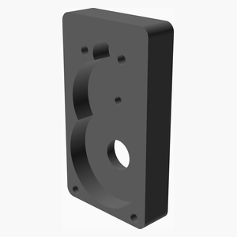 

### Sub-assemblies

| 1 x gearBox_part3_assembly |
|---|
|  

### Assembly instructions
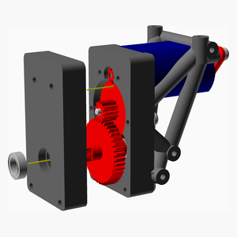

[Top](#TOP)

---

## GearBox Part5 Assembly
### Vitamins
|Qty|Description|
|---:|:----------|
|2| Screw M2 pan self tap x  6mm|

### 3D Printed parts

| 2 x Center_Drive_Cup.stl |
|---|
|  

### Sub-assemblies

| 1 x gearBox_part4_assembly |
|---|
|  

### Assembly instructions
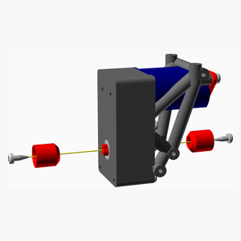

1. Insert both Center_Drive_Cup with 2 M2 self tapping screw 6 mm.

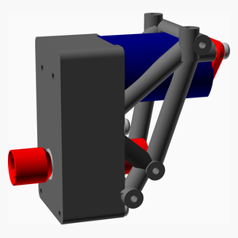

[Top](#TOP)

---

## GearBox Part6 Assembly
### Vitamins
|Qty|Description|
|---:|:----------|
|4| Screw M2 pan self tap x 12mm|

### 3D Printed parts

| 1 x frameBack_v2_1.stl |
|---|
|  

### Sub-assemblies

| 1 x gearBox_part5_assembly |
|---|
|  

### Assembly instructions

1.Install the frameBack_v2_1 with 4 M2 self tapping screw 12 mm.

[Top](#TOP)

---

## GearBox Part7 Assembly
### Vitamins
|Qty|Description|
|---:|:----------|
|4| Screw M2 pan self tap x  6mm|

### 3D Printed parts

| 1 x plate_long_v2.stl |
|---|
| 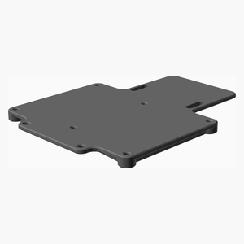 

### Sub-assemblies

| 1 x gearBox_part6_assembly |
|---|
|  

### Assembly instructions

1.Install the frameBack_v2_1 with 4 M2 self tapping screw 12 mm.

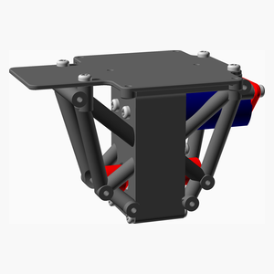

[Top](#TOP)

---

## GearBox Final Assembly
### Vitamins
|Qty|Description|
|---:|:----------|
|12| Screw M2 pan self tap x 10mm|

### 3D Printed parts

| 12 x 5_5_ball_Open.stl |
|---|
|  

### Sub-assemblies

| 1 x gearBox_part7_assembly |
|---|
|  

### Assembly instructions

[Top](#TOP)

---

## Suspension Part1 Assembly
### 3D Printed parts

| 4 x Ball_Link_29mm.stl | 4 x Ball_Link_41mm.stl |
|---|---|
|  | 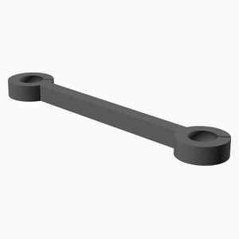 

### Sub-assemblies

| 2 x Axle_final_assembly | 2 x drive_shaft_assembly | 1 x gearBox_final_assembly |
|---|---|---|
|  |  | 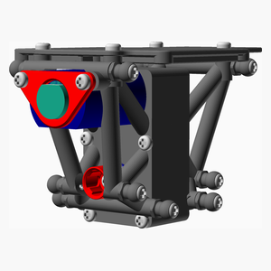 

### Assembly instructions
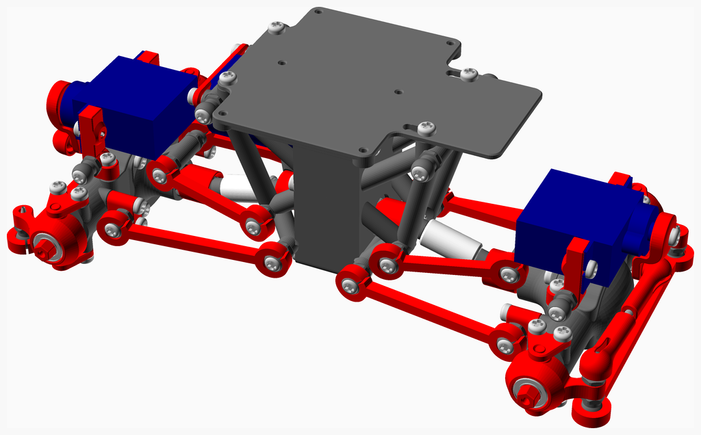

1. Proceed with one end at a time.
2. Install the 2 Ball_Link_41mm
3. Install the drive_shaft_assembly
4. Install the 2 Ball_Link_29mm
5. Proceed with the other end.

[Top](#TOP)

---

## Suspension Part2 Assembly
### 3D Printed parts

| 4 x shock_43mm.stl |
|---|
|  

### Sub-assemblies

| 1 x suspension_part1_assembly |
|---|
|  

### Assembly instructions
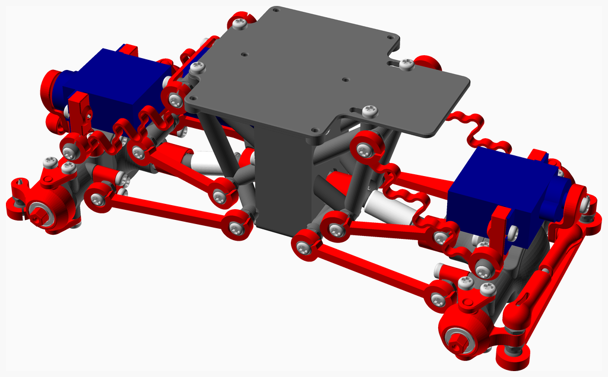

1. Install the shock. Pay attention to the opening at the ball joint: they should be facing up. This will make the shock bending downward when compressed.

[Top](#TOP)

---

## Main Assembly
### Vitamins
|Qty|Description|
|---:|:----------|
|4| Screw M2 pan self tap x  6mm|
|4| Screw M2 pan self tap x  8mm|

### 3D Printed parts

| 1 x Center_Drive_Shaft_P2_15_5mm.stl | 1 x body_v3.stl | 1 x shock_46mm.stl |
|---|---|---|
| 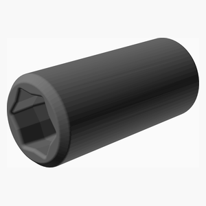 |  | 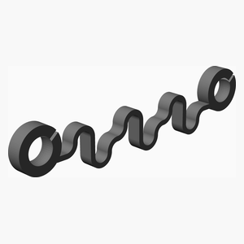 

| 1 x wheel_26_5mm.stl |
|---|
|  

### Sub-assemblies

| 1 x suspension_part2_assembly | 2 x wheel_left_assembly | 2 x wheel_right_assembly |
|---|---|---|
| 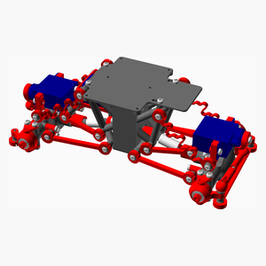 |  |  

### Assembly instructions

1. Install the 4 wheel with M2 self tapping screw 8 mm.
2. Install the body with 4 M2 self tapping screw 5 mm.

[Top](#TOP)
