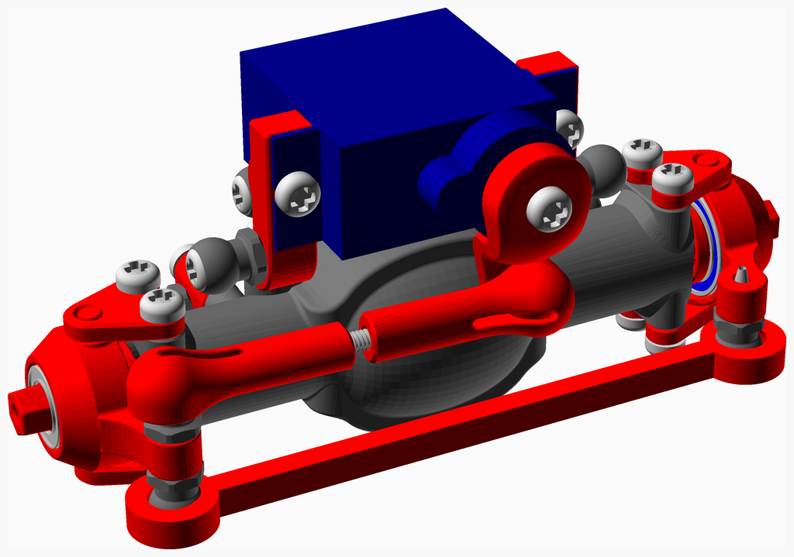
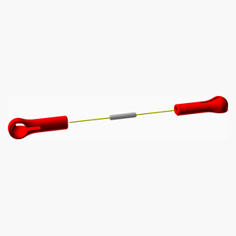
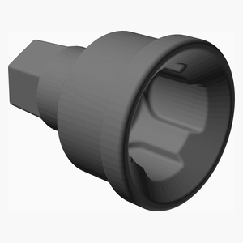
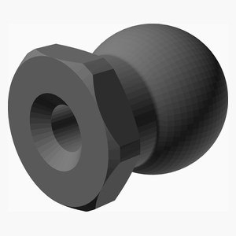
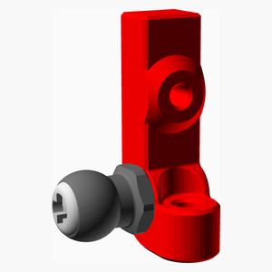
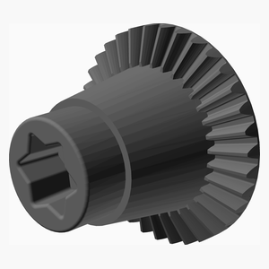
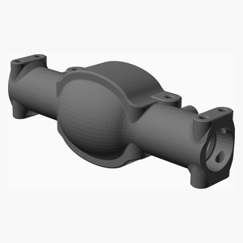
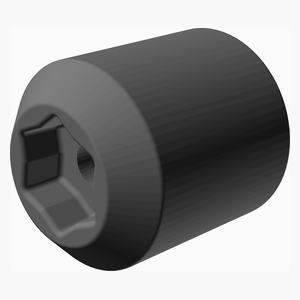
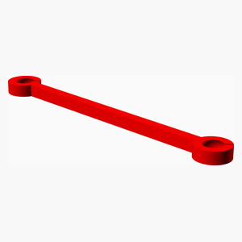

# RockCrawler
This is a remix version of an RC Rock Crawler that I found on Thingiverse.
The original model got deleted since then.
I modified the gearbox to make it slower, hence with more torque.

Video:
1. [In action](https://youtu.be/3EBpf9YP5C4)
2. [Showing the shock](https://youtu.be/YSYngEb9dG8)
3. [Gearbox assembly](https://youtu.be/KAkp_eB5qdQ)

I found a link to the original video from the original designer:
1. [Make an RC Rock Crawler - Part 1](https://www.youtube.com/watch?v=WgZuojB2sF8&t=138s)
2. [Make an RC Rock Crawler - Part 2](https://www.youtube.com/watch?v=jjvKoB2oO8Q&t=319s)

Documentation generated by the OpenSCAD library [NopSCADlib](https://github.com/nophead/NopSCADlib/tree/master).

License: [Creative Commons - Attribution - Share Alike](https://creativecommons.org/licenses/by-sa/3.0/).

---
## Table of Contents
1. [Parts list](#Parts_list)
1. [Servo Control Link Assembly](#Servo_control_link_assembly)
1. [Hub R Assembly](#Hub_R_assembly)
1. [Hub L Assembly](#Hub_L_assembly)
1. [Axle Part1 1 R Assembly](#Axle_part1_1_R_assembly)
1. [Axle Part1 1 L Assembly](#Axle_part1_1_L_assembly)
1. [G34 Assembly](#G34_assembly)
1. [Axle Part1 Assembly](#Axle_part1_assembly)
1. [Axle Part2 Assembly](#Axle_part2_assembly)
1. [Axle Part3 Assembly](#Axle_part3_assembly)
1. [Axle Part4 Assembly](#Axle_part4_assembly)
1. [Axle Part5 Assembly](#Axle_part5_assembly)
1. [Axle Part6 Assembly](#Axle_part6_assembly)
1. [Axle Part7 Assembly](#Axle_part7_assembly)
1. [Axle Final Assembly](#Axle_final_assembly)

[Top](#TOP)

---

## Parts list
| 2 x Axle&nbsp;Final | TOTALS |  |
|---:|---:|:---|
|  | | **Vitamins** |
| &nbsp;&nbsp;8&nbsp; |  &nbsp;&nbsp;8&nbsp; | &nbsp;&nbsp; Ball bearing MR128-2RS 8mm x 12mm x 3.5mm |
| &nbsp;&nbsp;6&nbsp; |  &nbsp;&nbsp;6&nbsp; | &nbsp;&nbsp; Ball bearing MR63ZZ 5mm x 8mm x 2.5mm |
| &nbsp;&nbsp;16&nbsp; |  &nbsp;&nbsp;16&nbsp; | &nbsp;&nbsp; Screw M2 pan self tap x  5mm |
| &nbsp;&nbsp;18&nbsp; |  &nbsp;&nbsp;18&nbsp; | &nbsp;&nbsp; Screw M2 pan self tap x  6mm |
| &nbsp;&nbsp;4&nbsp; |  &nbsp;&nbsp;4&nbsp; | &nbsp;&nbsp; Screw M2 pan self tap x  8mm |
| &nbsp;&nbsp;14&nbsp; |  &nbsp;&nbsp;14&nbsp; | &nbsp;&nbsp; Screw M2 pan self tap x 10mm |
| &nbsp;&nbsp;10&nbsp; |  &nbsp;&nbsp;10&nbsp; | &nbsp;&nbsp; Screw M2 pan self tap x 12mm |
| &nbsp;&nbsp;2&nbsp; |  &nbsp;&nbsp;2&nbsp; | &nbsp;&nbsp; Threaded rod M2 x 10mm |
| &nbsp;&nbsp;2&nbsp; |  &nbsp;&nbsp;2&nbsp; | &nbsp;&nbsp;RC servo SG90 |
| &nbsp;&nbsp;80&nbsp; | &nbsp;&nbsp;80&nbsp; | &nbsp;&nbsp;Total vitamins count |
|  | | **3D printed parts** |
| &nbsp;&nbsp;2&nbsp; |  &nbsp;&nbsp;2&nbsp; | &nbsp;&nbsp;5_5_ball_Closed.stl |
| &nbsp;&nbsp;16&nbsp; |  &nbsp;&nbsp;16&nbsp; | &nbsp;&nbsp;5_5_ball_Open.stl |
| &nbsp;&nbsp;2&nbsp; |  &nbsp;&nbsp;2&nbsp; | &nbsp;&nbsp;Axle_Case_p1.stl |
| &nbsp;&nbsp;2&nbsp; |  &nbsp;&nbsp;2&nbsp; | &nbsp;&nbsp;Axle_Case_p2.stl |
| &nbsp;&nbsp;8&nbsp; |  &nbsp;&nbsp;8&nbsp; | &nbsp;&nbsp;Axle_Case_p3.stl |
| &nbsp;&nbsp;4&nbsp; |  &nbsp;&nbsp;4&nbsp; | &nbsp;&nbsp;Axle_Case_p4.stl |
| &nbsp;&nbsp;2&nbsp; |  &nbsp;&nbsp;2&nbsp; | &nbsp;&nbsp;Ball_Link_62mm.stl |
| &nbsp;&nbsp;2&nbsp; |  &nbsp;&nbsp;2&nbsp; | &nbsp;&nbsp;Center_Drive_Cup.stl |
| &nbsp;&nbsp;4&nbsp; |  &nbsp;&nbsp;4&nbsp; | &nbsp;&nbsp;Drive_Cup.stl |
| &nbsp;&nbsp;4&nbsp; |  &nbsp;&nbsp;4&nbsp; | &nbsp;&nbsp;Drive_Shaft.stl |
| &nbsp;&nbsp;2&nbsp; |  &nbsp;&nbsp;2&nbsp; | &nbsp;&nbsp;G34_P14_p1.stl |
| &nbsp;&nbsp;2&nbsp; |  &nbsp;&nbsp;2&nbsp; | &nbsp;&nbsp;G34_P14_p2.stl |
| &nbsp;&nbsp;4&nbsp; |  &nbsp;&nbsp;4&nbsp; | &nbsp;&nbsp;Hub.stl |
| &nbsp;&nbsp;4&nbsp; |  &nbsp;&nbsp;4&nbsp; | &nbsp;&nbsp;Link_Closed_35mm.stl |
| &nbsp;&nbsp;2&nbsp; |  &nbsp;&nbsp;2&nbsp; | &nbsp;&nbsp;P14_G34.stl |
| &nbsp;&nbsp;4&nbsp; |  &nbsp;&nbsp;4&nbsp; | &nbsp;&nbsp;Servo_Holder.stl |
| &nbsp;&nbsp;2&nbsp; |  &nbsp;&nbsp;2&nbsp; | &nbsp;&nbsp;Servo_Horn.stl |
| &nbsp;&nbsp;66&nbsp; | &nbsp;&nbsp;66&nbsp; | &nbsp;&nbsp;Total 3D printed parts count |

[Top](#TOP)

---

## 2 x Servo Control Link Assembly
### Vitamins
|Qty|Description|
|---:|:----------|
|2| Threaded rod M2 x 10mm|

### 3D Printed parts

| 4 x Link_Closed_35mm.stl |
|---|
|  

### Assembly instructions

1. Screw both Link_Closed_35mm on a 10 mm M2 threaded rod. Leave a gap of about 1 or 2 mm in the middle.

[Top](#TOP)

---

## 2 x Hub R Assembly
### Vitamins
|Qty|Description|
|---:|:----------|
|2| Ball bearing MR128-2RS 8mm x 12mm x 3.5mm|
|2| Ball bearing MR63ZZ 5mm x 8mm x 2.5mm|
|2| Screw M2 pan self tap x 10mm|

### 3D Printed parts

| 2 x 5_5_ball_Open.stl | 2 x Drive_Cup.stl | 2 x Hub.stl |
|---|---|---|
|  |  |  

### Assembly instructions

1. Install a 5_5_ball_Open with a M2 self tapping screw 10 mm.
2. Install a bearing MR128 in the hub.
3. Install a bearing MR63 in the hub.
4. Install a Drive_Cup in the hub.

[Top](#TOP)

---

## 2 x Hub L Assembly
### Vitamins
|Qty|Description|
|---:|:----------|
|2| Ball bearing MR128-2RS 8mm x 12mm x 3.5mm|
|2| Ball bearing MR63ZZ 5mm x 8mm x 2.5mm|
|2| Screw M2 pan self tap x 12mm|

### 3D Printed parts

| 2 x 5_5_ball_Closed.stl | 2 x 5_5_ball_Open.stl | 2 x Drive_Cup.stl |
|---|---|---|
|  |  |  

| 2 x Hub.stl |
|---|
|  

### Assembly instructions

1. Crew together a 5_5_ball_Open and a 5_5_ball_Closed with a M2 self tapping screw 12 mm.
2. Install a bearing MR128 in the Hub.
3. Install a bearing MR63 in the Hub.
4. Install a Drive_Cup in the Hub.

[Top](#TOP)

---

## 2 x Axle Part1 1 R Assembly
### Vitamins
|Qty|Description|
|---:|:----------|
|2| Screw M2 pan self tap x  8mm|

### 3D Printed parts

| 2 x 5_5_ball_Open.stl | 2 x Servo_Holder.stl |
|---|---|
|  |  

### Assembly instructions

1. Install a 5_5_ball_Closed on right side of a Servo_Holder using a M2 self tapping screw 8 mm.

[Top](#TOP)

---

## 2 x Axle Part1 1 L Assembly
### Vitamins
|Qty|Description|
|---:|:----------|
|2| Screw M2 pan self tap x  8mm|

### 3D Printed parts

| 2 x 5_5_ball_Open.stl | 2 x Servo_Holder.stl |
|---|---|
|  |  

### Assembly instructions

1. Install a 5_5_ball_Closed on left side of a Servo_Holder using a M2 self tapping screw 8 mm.

[Top](#TOP)

---

## 2 x G34 Assembly
### Vitamins
|Qty|Description|
|---:|:----------|
|4| Ball bearing MR128-2RS 8mm x 12mm x 3.5mm|
|2| Screw M2 pan self tap x  6mm|

### 3D Printed parts

| 2 x G34_P14_p1.stl | 2 x G34_P14_p2.stl |
|---|---|
|  |  

### Assembly instructions

1. Insert G34_P14_p2 in G34_P14_p1 using a M2 self tapping screw 8 mm.
2. Add the ball bearing MR128 at both ends.

[Top](#TOP)

---

## 4 x Axle Part1 Assembly
### Vitamins
|Qty|Description|
|---:|:----------|
|4| Screw M2 pan self tap x 10mm|

### 3D Printed parts

| 4 x 5_5_ball_Open.stl | 4 x Axle_Case_p4.stl |
|---|---|
|  |  

### Assembly instructions

1. Install a 5_5_ball_Closed on Axel_Case_p4 using a M2 self tapping screw 8 mm.

[Top](#TOP)

---

## 2 x Axle Part2 Assembly
### Vitamins
|Qty|Description|
|---:|:----------|
|8| Screw M2 pan self tap x 12mm|

### 3D Printed parts

| 2 x Axle_Case_p1.stl |
|---|
|  

### Sub-assemblies

| 4 x Axle_part1_assembly |
|---|
|  

### Assembly instructions

1. Install both Axle_part1_assembly on the Axle_Case_p1 with 4 M2 self tapping screw 12 mm.

[Top](#TOP)

---

## 2 x Axle Part3 Assembly
### Vitamins
|Qty|Description|
|---:|:----------|
|2| Ball bearing MR63ZZ 5mm x 8mm x 2.5mm|
|8| Screw M2 pan self tap x  6mm|

### 3D Printed parts

| 2 x Axle_Case_p2.stl | 4 x Drive_Shaft.stl | 2 x P14_G34.stl |
|---|---|---|
|  |  |  

### Sub-assemblies

| 2 x Axle_part2_assembly | 2 x G34_assembly |
|---|---|
|  |  

### Assembly instructions

1. Insert G34_assembly in the axle.
2. Install ball bearing MR63 on P14_G34.
3. Install P14_G34 in Axle_Case_p2.
4. Fix Axle_Case_p2 on Axle_Case_p1 with 4 M2 self tapping screw 6 mm.
5. Insert both Drive_Shaft in axle. Note: there is no ball bearing on the shaft.

[Top](#TOP)

---

## 2 x Axle Part4 Assembly
### Vitamins
|Qty|Description|
|---:|:----------|
|8| Screw M2 pan self tap x 10mm|

### 3D Printed parts

| 4 x 5_5_ball_Open.stl |
|---|
|  

### Sub-assemblies

| 2 x Axle_part1_1_L_assembly | 2 x Axle_part1_1_R_assembly | 2 x Axle_part3_assembly |
|---|---|---|
|  |  |  

### Assembly instructions

1. Install two 5_5_ball_Closed on Axle_Case_p2 with M2 self tapping screw 10 mm.
2. Install the servo holders (Axle_part1_1_L_assembly & Axle_part1_1_R_assembly) on Axle_Case_p2 with 2 M2 self tapping screw 10 mm.

[Top](#TOP)

---

## 2 x Axle Part5 Assembly
### Vitamins
|Qty|Description|
|---:|:----------|
|16| Screw M2 pan self tap x  5mm|
|2| Screw M2 pan self tap x  6mm|

### 3D Printed parts

| 8 x Axle_Case_p3.stl | 2 x Center_Drive_Cup.stl |
|---|---|
|  |  

### Sub-assemblies

| 2 x Axle_part4_assembly | 2 x Hub_L_assembly | 2 x Hub_R_assembly |
|---|---|---|
|  |  |  

### Assembly instructions

1. Install the Center_Drive_Cup in the Axle with a M2 self tapping screw 8 mm.
2. Install the Hub_L_assembly along with two Axle_Case_p3 with 4 M2 self tapping screw 5 mm
3. Install the Hub_R_assembly along with two Axle_Case_p3 with 4 M2 self tapping screw 5 mm

[Top](#TOP)

---

## 2 x Axle Part6 Assembly
### Vitamins
|Qty|Description|
|---:|:----------|
|4| Screw M2 pan self tap x  6mm|
|2|RC servo SG90|

### Sub-assemblies

| 2 x Axle_part5_assembly |
|---|
|  

### Assembly instructions

1. Install the servo SG90 with 2 M2 self tapping screw 6 mm.

[Top](#TOP)

---

## 2 x Axle Part7 Assembly
### Vitamins
|Qty|Description|
|---:|:----------|
|2| Screw M2 pan self tap x  6mm|

### 3D Printed parts

| 2 x Servo_Horn.stl |
|---|
|  

### Sub-assemblies

| 2 x Axle_part6_assembly |
|---|
|  

### Assembly instructions

1. Install the servo horn using the screw that came with the servo.

[Top](#TOP)

---

## 2 x Axle Final Assembly
### 3D Printed parts

| 2 x Ball_Link_62mm.stl |
|---|
|  

### Sub-assemblies

| 2 x Axle_part7_assembly | 2 x Servo_control_link_assembly |
|---|---|
|  |  

### Assembly instructions

1. Install a Servo_control_link_assembly from the servo horn to left hub.
2. Install a Ball_Link_62mm between the two hubs.

[Top](#TOP)

---
1. To be continued

[Top](#TOP)
